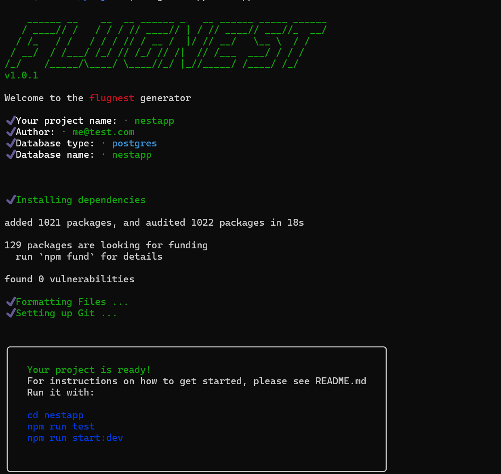

# flugnest-generator ✈️ <a href="http://nestjs.com/" target="blank"></a>


Flugnest-generator is a CLI tool that helps to setup [flugnest](https://github.com/Santiagomrn/flug-nest) applications.

[](https://npmjs.org/package/flugnest-generator)


# Installation 
Either through cloning with git or by using [npm](http://npmjs.org) (the recommended way)

```bash
npm install -g flugnest-generator
```

# Usage
Flugnest-generator is ready to use since is globally installed:

To generate an app run.
```bash
flugnest app [name of your app]
```
<p align="center">
<br>
<br>

</p>

To generate a module run in the root of your app.
```bash
flugnest module [name of your module]
```
<p align="center">
<br>
<br>

</p>

# App
The base flugnest app and documentation can be seen in [flugnest](https://github.com/Santiagomrn/flug-nest) 

# Test

```bash
cd [app name]
```
```bash
npm run test
```
<p align="center">
<br>
<br>

</p>